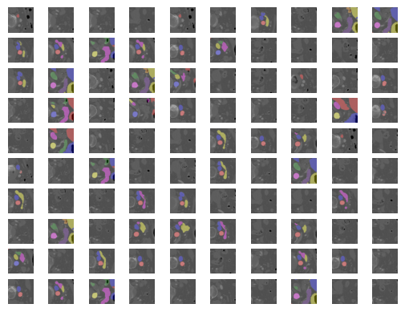
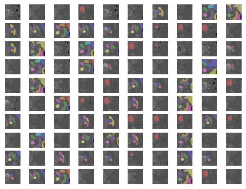

Fast organs localization on CT
==============================

|                     |  UNET  (exp1, 128)   | UNETR  (exp1, 128/256) | UNET  (exp2, 128) | UNETR  (exp2, 128) | UNET  (exp3, ch_3, 128) | UNETR  (exp3, ch_3, 128) | UNET  (exp3, ch_5, 128) | UNETR  (exp3, ch_5, 128) | UNET  (exp3, ch_10, 128) | UNETR  (exp3, ch_10, 128) |
|:-------------------:|:------------------------:|:--------------------------:|-----------------------|:----------------------:|:---------------------------:|:----------------------------:|:---------------------------:|------------------------------|------------------------------|-------------------------------|
|       spleen        |          0.3669          |      0.5756 / 0.5483       | 0.6836                |         0.6728         |           0.5489            |            0.5339            |           0.3993            | 0.5027                       | 0.4700                       | 0.5148                        |
|    right kidney     |          0.5549          |      0.4809 / 0.5604       | 0.7199                |         0.5690         |           0.5533            |            0.5050            |           0.3835            | 0.4628                       | 0.4478                       | 0.4642                        |
|     left kidney     |          0.5578          |      0.4645 / 0.5203       | 0.6560                |         0.5544         |           0.5591            |            0.4101            |           0.3957            | 0.4241                       | 0.4333                       | 0.3853                        |
|     gallbladder     |          0.0070          |      0.2871 / 0.4026       | 0.2133                |         0.3413         |           0.1316            |            0.3362            |           0.0250            | 0.2016                       | 0.0674                       | 0.2134                        |
|      esophagus      |          0.4014          |      0.3094 / 0.3653       | 0.5365                |         0.2705         |           0.4126            |            0.3028            |           0.3595            | 0.2724                       | 0.2930                       | 0.2286                        |
|        liver        |          0.1428          |      0.6533 / 0.6937       | 0.6000                |         0.7502         |           0.4376            |            0.6579            |           0.3176            | 0.6478                       | 0.3803                       | 0.6313                        |
|       stomach       |          0.2902          |      0.3077 / 0.3506       | 0.4272                |         0.3295         |           0.3410            |            0.3427            |           0.1787            | 0.3146                       | 0.2374                       | 0.2774                        |
|        aorta        |          0.5905          |      0.5424 / 0.5712       | 0.7268                |         0.5468         |           0.6261            |            0.5545            |           0.5998            | 0.5316                       | 0.5552                       | 0.5160                        |
|      postcava       |          0.3920          |      0.3731 / 0.3929       | 0.5034                |         0.4379         |           0.4426            |            0.3803            |           0.3549            | 0.3480                       | 0.3726                       | 0.3704                        |
|      pancreas       |          0.2834          |      0.2700 / 0.3102       | 0.3845                |         0.2581         |           0.2722            |            0.3040            |           0.1382            | 0.3235                       | 0.1925                       | 0.2554                        |
| right adrenal gland |          0.1209          |      0.2605 / 0.2879       | 0.2475                |         0.3075         |           0.1797            |            0.2350            |           0.0220            | 0.1737                       | 0.0769                       | 0.1500                        |
| left adrenal gland  |          0.1773          |      0.2078 / 0.2230       | 0.2977                |         0.1813         |           0.1591            |            0.1799            |           0.0757            | 0.1462                       | 0.1161                       | 0.0826                        |
|      duodenum       |          0.2497          |      0.1841 / 0.2088       | 0.2747                |         0.2166         |           0.2305            |            0.2116            |           0.1358            | 0.1858                       | 0.1370                       | 0.1825                        |
|       bladder       |          0.2561          |      0.3902 / 0.4367       | 0.4610                |         0.3484         |           0.4349            |            0.4087            |           0.2798            | 0.2648                       | 0.3945                       | 0.2774                        |
|   prostate/uterus   |          0.3977          |      0.4087 / 0.4463       | 0.3960                |         0.3243         |           0.4394            |            0.4468            |           0.3113            | 0.2440                       | 0.3418                       | 0.3127                        |

|                             Predictions                             |                           Targets                           |
|:-------------------------------------------------------------------:|:-----------------------------------------------------------:|
|  |  |

Project Organization
------------
    ├── README.md   
    ├── data
    │   ├── processed      <- The final, canonical data sets for modeling.
    │   └── raw            <- The original, zipped data.
    ├── docs
    ├── models             <- Trained and serialized models
    ├── notebooks
    ├── reports   
    │   └── figures        <- Generated graphics and figures to be used in reporting
    ├── requirements.txt 
    └──  src                <- Source code for use in this project.
       │
       ├── data           <- Scripts generate dataset
       │   └── make_dataset.py
       ├── models         <- Scripts to train models and then use trained models to make predictions
       │   ├── predict_model.py
       │   └── train_model.py
       └── visualization  <- Scripts to create exploratory and results oriented visualizations
           └── visualize.py

--------